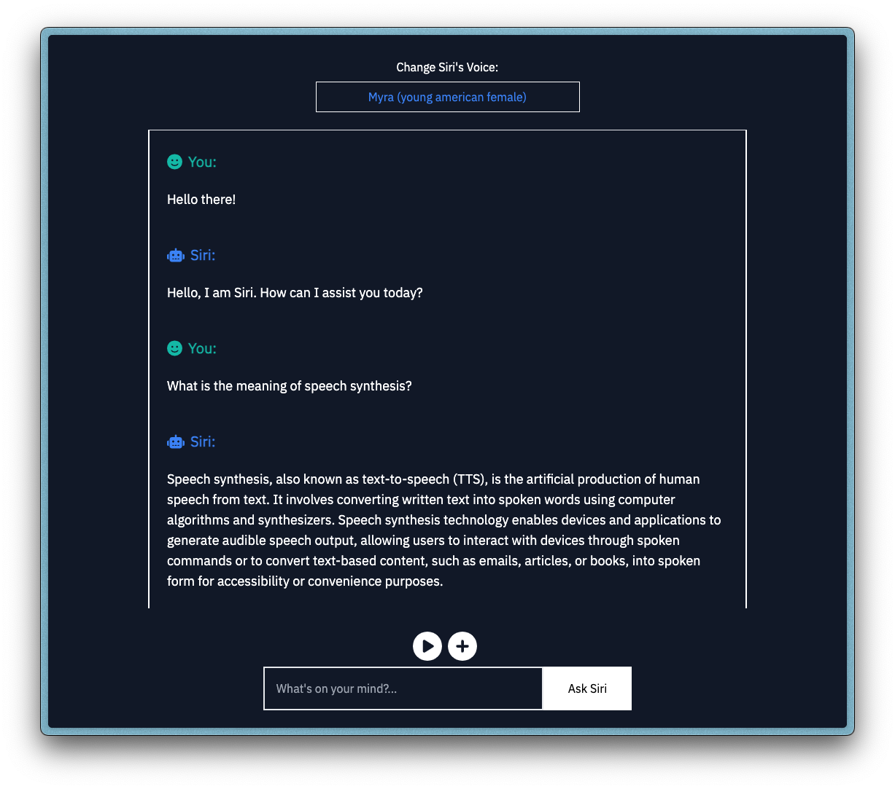
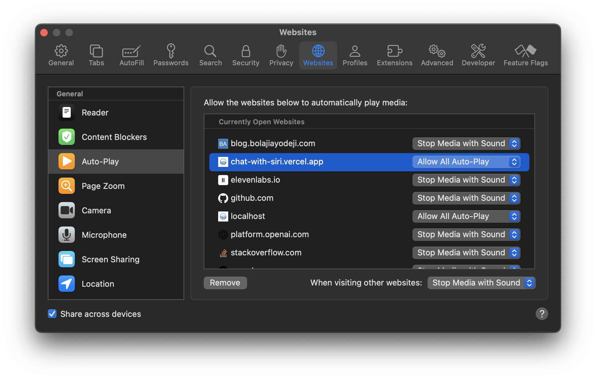

<div align="center">

[](https://chat-with-siri.vercel.app/chat)

A text-to-speech chatbot demo built using Nextjs, OpenAI's GPT-3 Chat Completions API, and ElevenLabs' Text-to-Speech API.

---

[]((https://chat-with-siri.vercel.app/chat))

</div>

> [!TIP]
>
> Kindly read [this comprehensive tutorial](https://blog.bolajiayodeji.com/how-to-build-an-audio-chatbot-with-nextjs-openai-and-elevenlabs) to learn how this was built and how you can build yours.

---

## Table of Contents

* [Features](#features)
* [Speech Engines (ElevenLabs & 60db)](#speech-engines-elevenlabs--60db)
* [Important Files and Folders](#important-files-and-folders)
* [Getting Started](#getting-started)
* [API Keys Guide](#api-keys-guide)
* [Troubleshooting](#troubleshooting)
* [Repo Stats Summary](#repo-stats-summary)
* [Contributors Guide](#contributors-guide)
* [License](#license)

---

## Features

* [x] A responsive, user-friendly, and performant UI built with TypeScript, Reactjs, Nextjs App Router, Tailwind CSS, and ElevenLabs TypeScript SDK.
* [x] PWA support for installation on mobile devices.
* [x] Users can ask a question by text and get a text response.
* [x] Users can ask a question by text and get an audio response.
* [x] Users can switch the speech engine between ElevenLabs and 60db at runtime.
* [x] Users can change the voice of the audio response (40+ options).
* [x] Users can replay the last audio response.
* [x] Users can start a new chat session.
* [x] Chat history and voice settings are saved to local storage.
* [x] Public live demo for users to explore with their API keys.
* [ ] Stream the text response from OpenAI.
* [ ] Allow process termination when the response is streaming (refactor the current loading indicator to a stop button).
* [ ] Pass the stream chunks from OpenAI directly to ElevenLabs.
* [ ] Stream the audio response from ElevenLabs to the UI.
* [ ] Increase the response tokens and characters.
* [ ] Add an option to choose the language translation of the audio response (using the `eleven _multilingual_v2` model).
* [ ] Theme toggle for light mode.

<div align="center">


</div>

## Speech Engines (ElevenLabs & 60db)

The audio response can be generated by **two interchangeable text-to-speech engines**: [ElevenLabs](https://elevenlabs.io) (default) and [60db](https://docs.60db.ai). You can switch between them at runtime using the **Speech Engine** dropdown at the top of the chat page; the choice (and your selected voice) is saved to `localStorage`.

Both engines are wired through a single **provider abstraction** in [`/app/lib/providers`](./app/lib/providers), so the rest of the app (UI, chat flow, audio playback) is identical no matter which engine is active:

| Concern                | ElevenLabs                                   | 60db                                                  |
| ---------------------- | -------------------------------------------- | ----------------------------------------------------- |
| Voices                 | `voices.getAll()` (global preset voices)     | `GET /myvoices` (your own cloned/professional voices) |
| Synthesis              | SDK `generate()` → raw MP3 stream            | `POST /tts-synthesize` → JSON with base64 audio       |
| Voice selection key    | `voice_id`                                   | `voice_id`                                            |
| Settings scale         | `stability` / `similarity_boost` (0–1)       | `stability` / `similarity` (0–100)                    |
| API key                | `ELEVENLABS_API_KEY` / your key in the UI    | `SIXTYDB_API_KEY` / your key in the UI                |

Internally, everything is normalized so the engines behave consistently:

* Voices from both providers are mapped to one shared `NormalizedVoice` shape (`voice_id`, `name`, `descriptor`, `accent`, `gender`) and selected by `voice_id`.
* Synthesis settings are expressed on a single 0–1 scale in the app; the 60db provider rescales them to its own 0–100 range.
* 60db's base64 JSON audio is decoded server-side and served as `audio/mpeg`, exactly like ElevenLabs, so the browser playback code never changes.

> [!NOTE]
>
> 60db's `GET /myvoices` returns **your** voices, so in production you must enter your 60db key before the 60db voice list appears. If you have no 60db voices yet, the app falls back to 60db's system default voice. ElevenLabs voices are global presets and load on first render.

### How to use it

1. Add the relevant key(s) — `ELEVENLABS_API_KEY` and/or `SIXTYDB_API_KEY` — to `.env.local` for local development, or enter them in the in-app settings form when running in production mode.
2. Open the chat page and pick **ElevenLabs** or **60db** from the **Speech Engine** dropdown.
3. Choose a voice from the **Change Siri's Voice** dropdown (the list updates to match the selected engine).
4. Ask Siri a question — the text reply comes from OpenAI and the spoken reply is generated by the engine you selected.

## Important Files and Folders

| **Path**                           | **Description**                                 |
| ---------------------------------- | ----------------------------------------------- |
| `.env.example`                     | Example file with all the required environment variables.                           |  
| `/app/chat/route.ts`               | API route handler for communicating with OpenAI.                              |
| `/app/speech/route.ts`             | API route handler for speech synthesis (dispatches to the selected provider). |
| `/app/lib/providers/`              | Provider abstraction (ElevenLabs + 60db) with a shared voice/synthesis interface. |
| `/app/components/storeApiKeys.tsx` | React component for the user API keys section of the UI.                                  |
| `/app/components/chatProvider.tsx` | React component for the speech-engine (provider) selector.                                  |
| `/app/components/chatVoice.tsx`    | React component for the voice selection section of the UI.                                  |
| `/app/components/chatMessages.tsx` | React component for the chat messages section of the UI.                                  |
| `/app/components/chatControls.tsx` | React component for the user controls section of the UI.                                  |
| `/app/components/chatInput.tsx`    | React component for the user input section of the UI.                                  |
| `/hooks/useLocalStorage.ts`        | React hooks to save and fetch data from localStorage. |
| `/app/layout.tsx`                  | Shared UI for fonts and metadata configuration.                       |
| `/app/page.tsx`                    | Home page (`/`).                                 |
| `/app/chat/page.tsx`               | Chat page (`/chat`).                             |
| `/utils/getVoices.ts`              | Utility file to fetch voices from ElevenLabs.    |
| `/utils/notifyUser.ts`             | Utility file for toast notifications.            |
| `/types/chat.ts`                   | Types for the entire project.                    |

## Getting Started

To run this application locally, kindly follow the steps below:

1. Rename the `.env.example` file to `.env.local` and fill in the required environment variables.
    * `NEXT_PUBLIC_APP_MODE` - `development` or `production`.
    * `OPENAI_API_KEY` - OpenAI API key ([sign up and get one here](https://platform.openai.com/api-keys)).
    * `ELEVENLABS_API_KEY` - ElevenLabs API key ([sign up and get one here](http://elevenlabs.io/?from=bolajiayodeji2995)).
    * `SIXTYDB_API_KEY` - 60db API key (used when the "60db" speech engine is selected). Only one of the two speech-engine keys is required, depending on which engine you use.

2. Install all required dependencies with the `npm install` command (or use `yarn` / `pnpm`).

3. Run the development server with the command `npm run dev`.

4. Open [`http://localhost:3000`](http://localhost:3000) with your browser to see the result.

5. All good! You can start modifying any page and the app will auto-update.

## API Keys Guide

To enable anyone to test the application in production if they want to, I've added a form where they can enter their API keys for both OpenAI and ElevenLabs (so I don't have to cover the costs and deal with request overload since this is a basic demo for now). This is a good way for anyone to test the application without having to clone and run it locally. To create both API keys (if you don't have one already), **kindly read this section of [the tutorial](https://blog.bolajiayodeji.com/how-to-build-an-audio-chatbot-with-nextjs-openai-and-elevenlabs#heading-setting-up-openai)**. Once you have the keys, click on the settings icon at the top section of the page, and enter them in the form provided. You can repeat the same process to update the keys.

> [!WARNING]
>
> **Both API keys are stored on your local computer and are not saved to any database or sent to any server/third-party service (they're stored in [`localStorage`](https://developer.mozilla.org/en-US/docs/Web/API/Window/localStorage) and you can [read the code](./app/components/storeApiKeys.tsx) yourself)**. The keys are only used to make API requests on your behalf each time you want to use the app. This is safe and secure for anyone to use **if you guarantee that no one else has access to your computer or browser**. You can use the "Delete" button in the form to remove the API keys from your local storage at any time.

Enjoy chatting with Siri!

## Troubleshooting

If you're accessing the application on the Safari browser, you might get the `NotAllowedError: The request is not allowed by the user agent or the platform in the current context, possibly because the user denied permission` error. This is because the browser doesn't allow autoplaying audio by default. You can fix this by going to the browser's Auto-Play settings as seen in the screenshot below and changing the option for the `chat-with-siri.vercel.app` website from `Stop Media with Sound` to `Allow All Auto-Play`. If you refresh now, the audio should work fine.



## Repo Stats Summary


## Contributors Guide

1. Fork [this repository](https://github.com/BolajiAyodeji/chat-with-siri) (learn how to do this [here](https://help.github.com/articles/fork-a-repo)).

2. Clone the forked repository like so:

```bash
git clone https://github.com/<your username>/chat-with-siri.git && cd chat-with-siri
```

3. Make your changes and create a pull request ([learn how to do this](https://docs.github.com/en/github/collaborating-with-issues-and-pull-requests/creating-a-pull-request)).

4. I'll attend to your pull request soon and provide some feedback.

## License

This repository is published under the [MIT](LICENSE) license.

---

<div align="center">
<a href="https://bolajiayodeji.com" target="_blank" rel="noopener noreferrer"></a>
</div>
